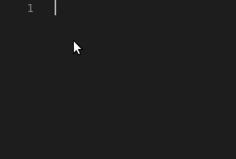

# Seja bem vindo(a) ao meu github! 😬🤙🏾

- 📚 Estudante do <a href="https://cursoemvideo.com" target="_blank">Curso em Video</a>
- 👩‍💻 Aprendendo sobre back-end:  
Com o auxilo do profº <a href="https://github.com/gustavoguanabara" target="_blank">Gustavo Guanabara</a> estou aprendendo, descobrindo ferramentas e ficando cada vez mais curioso rsrsrs...

  &nbsp;
  &nbsp;
  &nbsp;

- Por enquanto é isso, vou buscando mais XP e até novos commits 😉
